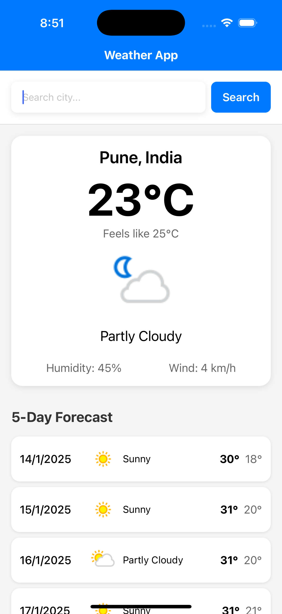

# Weather Forecast App

A React Native application that provides weather forecasts using the WeatherAPI.com API. The app displays current weather conditions and a 5-day forecast for any searched city.

## Features

- Current weather information including:
  - Temperature
  - "Feels like" temperature
  - Humidity
  - Wind speed
  - Weather condition with icon
- 5-day weather forecast showing:
  - Daily high and low temperatures
  - Weather conditions
  - Date
- Search functionality for any city
- Error handling for failed API requests
- Loading states for better UX
- Responsive design that works on both iOS and Android

## Technical Stack

- **React Native**: For cross-platform mobile development
- **TypeScript**: For type safety and better development experience
- **Redux Toolkit**: For state management
- **Axios**: For API requests
- **React Native Vector Icons**: For weather-related icons
- **WeatherAPI.com**: As the weather data provider

## Project Structure

```
src/
├── components/
│   ├── SearchBar.tsx
│   ├── CurrentWeather.tsx
│   ├── LoadingSpinner.tsx
│   └── ForecastItem.tsx
├── navigation/
│   ├── types.ts
│   └── AppNavigation.tsx
├── screens/
│   └── HomeScreen.tsx
├── store/
│   ├── index.ts
│   ├── store.ts
│   └── weatherSlice.ts
├── types/
│   └── weather.ts
└── App.tsx
```

## Setup Instructions

1. Clone the repository:
```bash
git clone https://github.com/ganeshwajenagarro/weatherforecastapp.git
cd weatherforecastapp
```

2. Install dependencies:
```bash
npm install
```

3. Configure API key:
   - Default API added in code inside src/api/weatherApi.ts
   - If need to update the key then 
   - Add your API key: `const API_KEY = your_api_key_here`

4. Install iOS dependencies (macOS only):
```bash
cd ios
pod install
cd ..
```

5. Start the application:
```bash
# Start Metro bundler
npm start

# Run on Android
npm run android

# Run on iOS
npm run ios
```

## Technical Decisions

1. **Redux Toolkit**
   - Chosen for efficient state management
   - Provides good TypeScript integration
   - Includes built-in tools for handling async actions

2. **Folder Structure**
   - Component-based organization
   - Separate folders for screens, components, and store
   - Clear separation of concerns

## Areas for Improvement

Future enhancements could include:
- Unit tests using Jest
- E2E tests using Detox
- Location-based weather detection
- Weather alerts
- Additional weather details
- Dark mode support
- Multiple language support

## Screenshots



## Author

Ganesh Waje